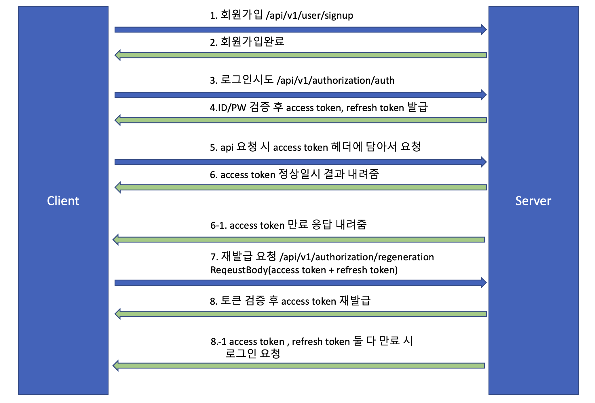

# spring security + jwt


## 개발 환경
- 기본 환경
    - IDE: IntelliJ IDEA
    - OS: Mac
    - GIT
- Server
    - Java11
    - Spring Boot
    - JPA
    - gradle
    - h2

## 빌드. 실행
Intellij 기준입니다.
- 빌드 ```./gradlew clean build```
- 실행 ```디버그 모드로 실행(control + D)```

## 전체로직


